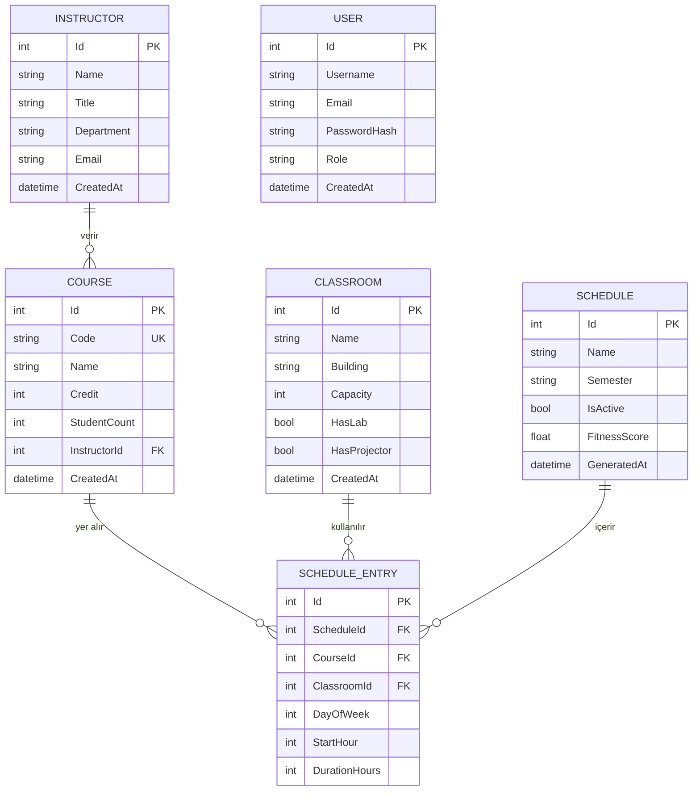

# SmartScheduler — Veritabanı Şema Tasarımı

**Veritabanı:** PostgreSQL 16  
**ORM:** Entity Framework Core 9 (Code-First)  
**Sprint:** 2'de uygulanacak

---

## ER Diyagramı (Mermaid)



---

## Tablo Detayları

### Instructor (Hoca)
```sql
CREATE TABLE "Instructors" (
    "Id"         SERIAL PRIMARY KEY,
    "Name"       VARCHAR(100) NOT NULL,
    "Title"      VARCHAR(50)  NOT NULL,   -- Prof. Dr., Doç. Dr., Dr. Öğr. Üyesi
    "Department" VARCHAR(100) NOT NULL,
    "Email"      VARCHAR(150) UNIQUE NOT NULL,
    "CreatedAt"  TIMESTAMP DEFAULT NOW()
);
```

### Course (Ders)
```sql
CREATE TABLE "Courses" (
    "Id"            SERIAL PRIMARY KEY,
    "Code"          VARCHAR(20)  UNIQUE NOT NULL,  -- CS301
    "Name"          VARCHAR(150) NOT NULL,
    "Credit"        INT NOT NULL CHECK ("Credit" BETWEEN 1 AND 6),
    "StudentCount"  INT NOT NULL DEFAULT 0,
    "InstructorId"  INT NOT NULL REFERENCES "Instructors"("Id"),
    "CreatedAt"     TIMESTAMP DEFAULT NOW()
);
```

### Classroom (Sınıf)
```sql
CREATE TABLE "Classrooms" (
    "Id"           SERIAL PRIMARY KEY,
    "Name"         VARCHAR(50) NOT NULL,
    "Building"     VARCHAR(100),
    "Capacity"     INT NOT NULL CHECK ("Capacity" > 0),
    "HasLab"       BOOLEAN NOT NULL DEFAULT FALSE,
    "HasProjector" BOOLEAN NOT NULL DEFAULT TRUE,
    "CreatedAt"    TIMESTAMP DEFAULT NOW()
);
```

### Schedule (Program)
```sql
CREATE TABLE "Schedules" (
    "Id"           SERIAL PRIMARY KEY,
    "Name"         VARCHAR(150) NOT NULL,
    "Semester"     VARCHAR(50) NOT NULL,   -- "2025-2026 Bahar"
    "IsActive"     BOOLEAN NOT NULL DEFAULT FALSE,
    "FitnessScore" FLOAT,
    "GeneratedAt"  TIMESTAMP DEFAULT NOW()
);
```

### ScheduleEntry (Program Girdisi)
```sql
CREATE TABLE "ScheduleEntries" (
    "Id"             SERIAL PRIMARY KEY,
    "ScheduleId"     INT NOT NULL REFERENCES "Schedules"("Id") ON DELETE CASCADE,
    "CourseId"       INT NOT NULL REFERENCES "Courses"("Id"),
    "ClassroomId"    INT NOT NULL REFERENCES "Classrooms"("Id"),
    "DayOfWeek"      INT NOT NULL CHECK ("DayOfWeek" BETWEEN 0 AND 4),  -- 0=Pzt, 4=Cum
    "StartHour"      INT NOT NULL CHECK ("StartHour" BETWEEN 8 AND 18),
    "DurationHours"  INT NOT NULL DEFAULT 2
);
```

### User (Kullanıcı — Sprint 2 Auth)
```sql
CREATE TABLE "Users" (
    "Id"           SERIAL PRIMARY KEY,
    "Username"     VARCHAR(50)  UNIQUE NOT NULL,
    "Email"        VARCHAR(150) UNIQUE NOT NULL,
    "PasswordHash" VARCHAR(255) NOT NULL,
    "Role"         VARCHAR(20)  NOT NULL DEFAULT 'User',  -- Admin, User
    "CreatedAt"    TIMESTAMP DEFAULT NOW()
);
```

---

## EF Core Entity Sınıfları (C#)

### Instructor.cs
```csharp
public class Instructor
{
    public int Id { get; set; }
    public string Name { get; set; } = string.Empty;
    public string Title { get; set; } = string.Empty;
    public string Department { get; set; } = string.Empty;
    public string Email { get; set; } = string.Empty;
    public DateTime CreatedAt { get; set; } = DateTime.UtcNow;
    public ICollection<Course> Courses { get; set; } = [];
}
```

### Course.cs
```csharp
public class Course
{
    public int Id { get; set; }
    public string Code { get; set; } = string.Empty;
    public string Name { get; set; } = string.Empty;
    public int Credit { get; set; }
    public int StudentCount { get; set; }
    public int InstructorId { get; set; }
    public Instructor Instructor { get; set; } = null!;
    public DateTime CreatedAt { get; set; } = DateTime.UtcNow;
    public ICollection<ScheduleEntry> ScheduleEntries { get; set; } = [];
}
```

### Classroom.cs
```csharp
public class Classroom
{
    public int Id { get; set; }
    public string Name { get; set; } = string.Empty;
    public string? Building { get; set; }
    public int Capacity { get; set; }
    public bool HasLab { get; set; }
    public bool HasProjector { get; set; } = true;
    public DateTime CreatedAt { get; set; } = DateTime.UtcNow;
    public ICollection<ScheduleEntry> ScheduleEntries { get; set; } = [];
}
```

### Schedule.cs
```csharp
public class Schedule
{
    public int Id { get; set; }
    public string Name { get; set; } = string.Empty;
    public string Semester { get; set; } = string.Empty;
    public bool IsActive { get; set; }
    public double? FitnessScore { get; set; }
    public DateTime GeneratedAt { get; set; } = DateTime.UtcNow;
    public ICollection<ScheduleEntry> Entries { get; set; } = [];
}
```

### ScheduleEntry.cs
```csharp
public class ScheduleEntry
{
    public int Id { get; set; }
    public int ScheduleId { get; set; }
    public Schedule Schedule { get; set; } = null!;
    public int CourseId { get; set; }
    public Course Course { get; set; } = null!;
    public int ClassroomId { get; set; }
    public Classroom Classroom { get; set; } = null!;
    public int DayOfWeek { get; set; }   // 0=Pazartesi … 4=Cuma
    public int StartHour { get; set; }   // 8 … 18
    public int DurationHours { get; set; } = 2;
}
```

---

## Seed Data (İlk Migration)

Sprint 2'de EF Core migration çalıştırıldığında aşağıdaki test verisi otomatik eklenecek:

- 4 Hoca (mevcut in-memory verisi)
- 5 Ders (mevcut in-memory verisi)
- 5 Sınıf (mevcut in-memory verisi)

---

*DevArchitechs · SmartScheduler · Veritabanı Şema v1.0*
